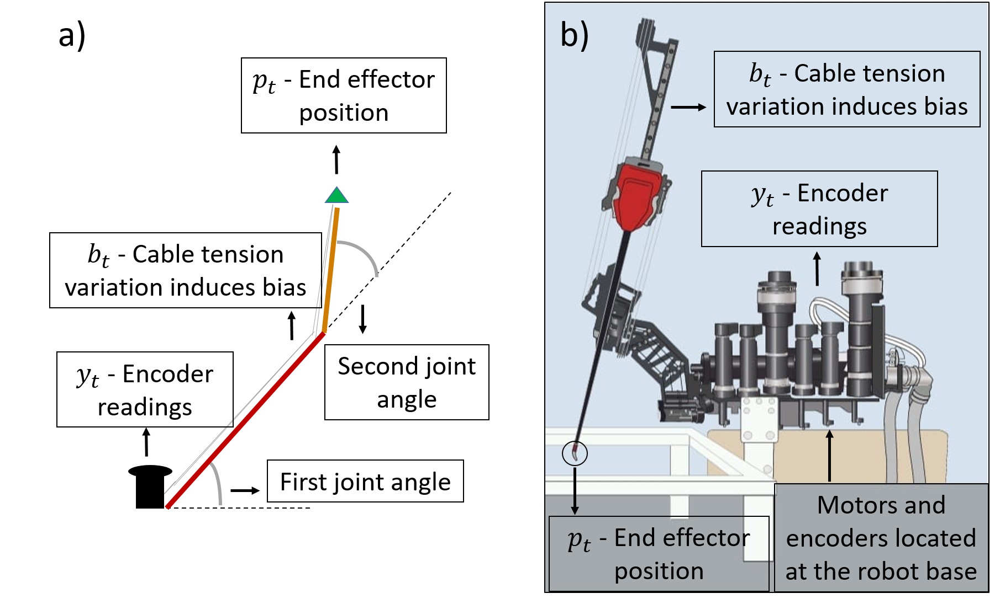

# KalmanNet_for_surgical_robots

## Running the code
- **Planar robot case:**

  Use the Planar_robot directory and run the following:

  `python3 main_RR_planar_robot.py`

- **Raven II simulated case:**

  Use the Raven_II_simulation_case directory and run the following:

  `python3 main_Raven_Full_pipeline.py`
  
## Parameters Settings

**Planar robot case:**
- Simulations/RR_planar_robot/parameters.py

  Contains model settings: m, n, f, h, Q and R, L1, L2.
  
- Simulations/RR_planar_robot/data/Simulations_instructions_for_train_and_validation_sets.xlsx
  
  setting parameters for training and validation sets.
  
- Simulations/config.py
  
  Contain dataset size, training parameters and network settings.
  
- main file
  
  Set flags, paths, etc..

**Raven II simulated case:**
- Simulations/Raven_ii_matlab/parameters_withbias_trainIK.py
    
  Contains model settings: m, n, f, h, Q and R, L1, L2.

- Simulations/config.py
  
  Contain dataset size, training parameters and network settings.
  
- main file
  
  Set flags, paths, etc..
    

